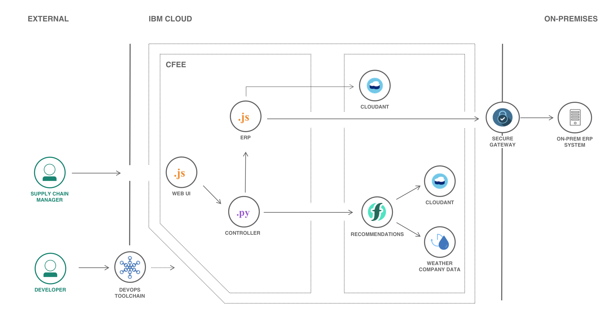
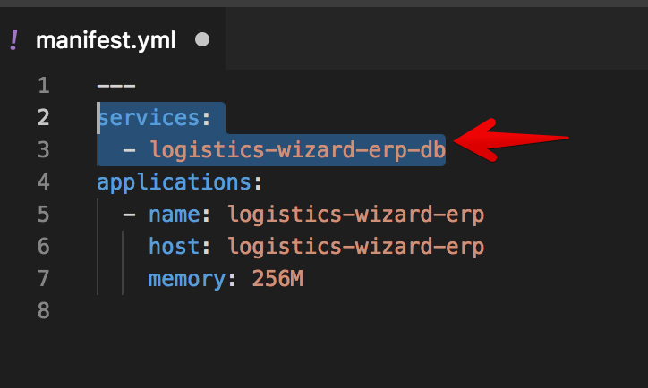
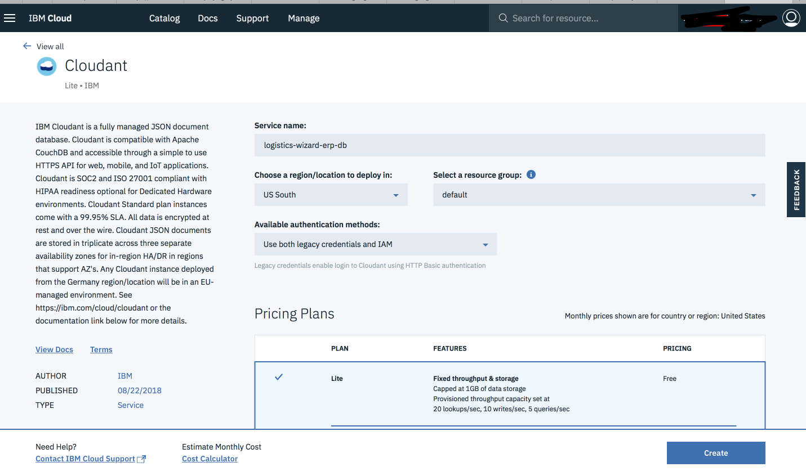
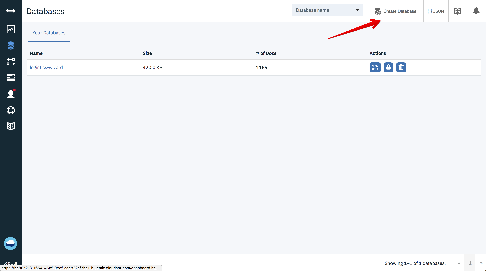
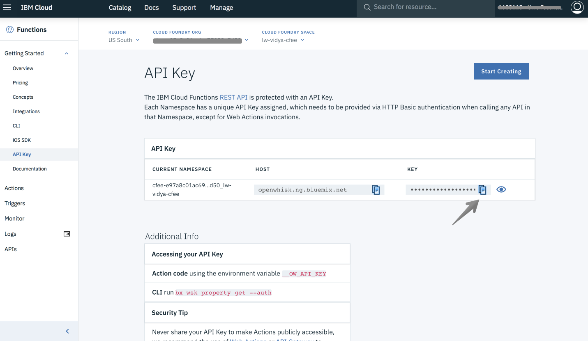
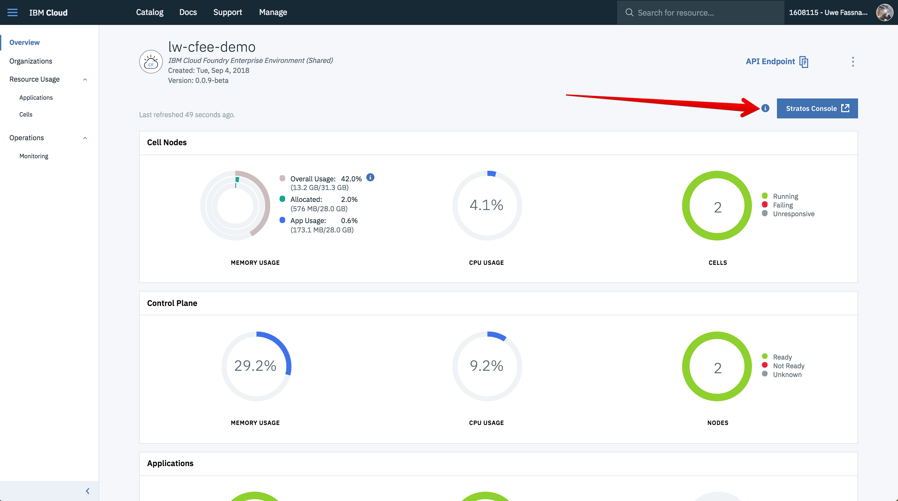
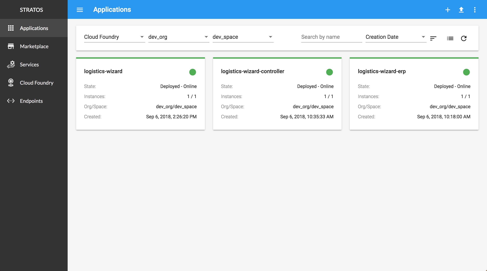
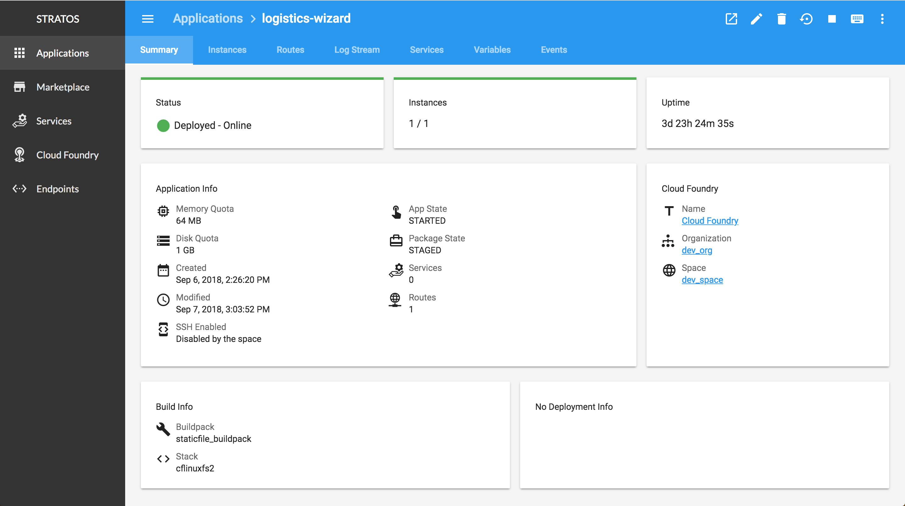

# Deploy Logistics Wizard to Cloud Foundry Enterprise Environment (CFEE)

Step by step guide to deploy Logistic Wizard to Cloud Foundry Enterprise Environment(CFEE). The Logistic Wizard app is broken down into many microservices to function different part of the application. There are three runtimes(WebUI, ERP, and Controller) all of which deployed to CFEE while the services located in the public Cloud Foundry and been linked to the CFEE account. You may be thinking why to use CFEE at first place. 

With the IBM® Cloud Foundry Enterprise Environment (CFEE), you can instantiate multiple, isolated, enterprise-grade Cloud Foundry platforms on demand. Instances of the IBM Cloud Foundry Enterprise service run within your own account in the IBM Cloud. The environment is deployed on isolated hardware (Kubernetes clusters). You have full control over the environment, including access control, capacity management, change management, monitoring, and services.

**CFEE**

- Web UI runtime
- ERP runtime
- Controller runtime

**Non-CFEE**

- Cloudant used by the ERP
- Cloud Functions
- Cloudant used by Cloud Functions
- Weather Company Data used by Cloud Functions

The services must be created within the public Cloud Foundry(CF) and then linked to your Cloud Foundry Enterprise Environment (CFEE).

## Architecture

Logistics Wizard consists of several microservices.



## Getting Started 

1. If this instruction guide, you will explore deploying Logistic Wizard to CFEE. First, you would need a CFEE instance created to follow this guide. If you don't have one already, then you can create one by following the steps 1 & 2 in this [link](https://console.bluemix.net/dashboard/cloudfoundry/quickstart).

2. The instructions below deploys to the US South region, but you can deploy to other regions available depending on your requirements.
   - (US South) public CF API endpoint: [https://api.ng.bluemix.net](https://api.ng.bluemix.net/)
   - (US South) CFEE API endpoint:   https://api.<ENVIRONMENT_NAME\>-cluster.us-south.containers.appdomain.cloud
   - You can get your CFEE API endpoint from the IBM Cloud [CFEE dashboard](https://console.bluemix.net/dashboard/cloudfoundry?filter=cf_environments). 

## Set up the ERP

1. In your terminal, point to public CF API endpoint and login targeting your Org and Space.

   ```bash
   cf api https://api.ng.bluemix.net
   ic api https://api.ng.bluemix.net
   ic target --cf
   cf login
   ```

2. Then clone `logistics-wizard-erp` repo.

   ```bash
   git clone https://github.com/IBM-Cloud/logistics-wizard-erp
   cd logistics-wizard-erp
   ```

3. Edit the `manifest.yml` file and remove the `logistics-wizard-erp-db` service listed.

   

4. Switch to CFEE API endpoint and target your CFEE Org and Space.

   ```bash
   cf api <CFEE_API ENDPOINT>
   cf login
   ```
   **Note:** For creating CFEE Org and Space, refer https://console.bluemix.net/docs/cloud-foundry/orgs-spaces.html#create_orgs

5. Push the ERP to CFEE.

   ```bash
   cf push --no-start
   ```
6. Create the Cloudant NoSQLDB service for the ERP. Navigate to [IBM Cloud Dashboard](https://console.bluemix.net/dashboard/apps) > Create Resource > Search for Cloudant > name it as `logistics-wizard-erp-db`.


7. Create the database called `logistics-wizard` by launching the Cloudant dashboard. 

8. On the CFEE dashboard, click on the Org you created under Organizations > Spaces > Space name > Services and then Create a service alias for the Cloudant Service `logistics-wizard-erp-db` and then bind it to the `logistics-wizard-erp` application. 

9. Start the ERP microservice.

   ```bash
   cf start logistics-wizard-erp
   ```

10. After starting the ERP microservice, you can verify it is running.

   

## Set up the Controller Service

1. Clone the controller repo.

   ```bash
   git clone https://github.com/IBM-Cloud/logistics-wizard-controller
   cd logistics-wizard-controller
   ```

2. Push the controller microservice without starting.

   ```bash
   cf push --no-start
   ```

3. Set the environment variables for the controller to connect to the ERP. You can get the `OPENWHISK_AUTH` API key from the [IBM Cloud console](https://console.bluemix.net/openwhisk/learn/api-key). Choose the Region, Org and Space where you have rest of the services created.


On a Terminal, run the below commands by providing appropriate values

   ```
cf set-env logistics-wizard-controller ERP_SERVICE 'https://<erp-URL>'
cf set-env logistics-wizard-controller OPENWHISK_AUTH <openwhisk-auth>
cf set-env logistics-wizard-controller OPENWHISK_PACKAGE lwr
   ```

4. Start the controller microservice.

   ```bash
   cf start logistics-wizard-controller
   ```

## Set up the WebUI

1. Clone the logistics-wizard-webui repo.

   ```bash
   git clone https://github.com/IBM-Cloud/logistics-wizard-webui
   cd logistics-wizard-webui
   ```

2. Install the dependencies.

   ```bash
   npm install
   ```

3. Build the static files for the WebUI using the appropriate environment variables.

   ```bash
   export CONTROLLER_SERVICE=<controller-service-URL>
   npm run deploy:prod
   ```

    For example, `CONTROLLER_SERVICE=https://logistics-wizard-controller.lw-cfee-demo-cluster.us-south.containers.appdomain.cloud/`

4. Deploy the WebUI to CFEE.

   ```bash
   cd dist
   cf push logistics-wizard
   ```

## Set up the Cloud Functions Actions

Cloud Functions is outside CFEE, so you would need to switch to the public CF to complete below section.

1. Switch to public Cloud Foundry.

   ```bash
   cf api https://api.ng.bluemix.net
   cf login
   ```

2. Create the two services, `Cloudant` and  `Weather Company Data` service.

   ```bash
   cf create-service weatherinsights Base-v2 logistics-wizard-weatherinsights
   cf create-service cloudantNoSQLDB Lite logistics-wizard-recommendation-db
   ```
   **Note**: weatherinsights Base-v2 requires a `paid` account and your account will be charged.

3. Create service keys for two services created, **take note of the URL values as it would be needed in step 6.**

   ```bash
   cf create-service-key logistics-wizard-weatherinsights for-openwhisk
   cf create-service-key logistics-wizard-recommendation-db for-openwhisk
   cf service-key logistics-wizard-weatherinsights for-openwhisk
   cf service-key logistics-wizard-recommendation-db for-openwhisk
   ```

4. Clone the logistics-wizard-recommendation repo.

   ```bash
   git clone https://github.com/IBM-Cloud/logistics-wizard-recommendation
   cd logistics-wizard-recommendation
   ```

5. Copy the local env template file.

   ```bash
   cp template-local.env local.env
   ```

6. Using the URL values from the terimal output above, update the local.env file to look like the following:

   ```bash
   PACKAGE_NAME=lwr
   CONTROLLER_SERVICE=<controller-service-URL>
   WEATHER_SERVICE=<logistics-wizard-weatherinsights-URL>
   CLOUDANT_URL=<logistics-wizard-recommendation-db-URL>
   CLOUDANT_DATABASE=recommendations
   ```

7. Build your Cloud Functions actions.

   Note: node version >=4.2.0 required and npm >=3.0.0

   ```bash
   npm install
   npm run build
   ```

8. Deploy your Cloud Functions actions:

   ```bash
   ./deploy.sh --install
   ```

9. Done, now access the WebUI URL in the browser and explore the app running on CFEE. 


## Set up Stratos Console

1. Install Stratos Console by following the install wizard, select the Kubernetes cluster option when installing.

2. Open the Stratos Console to

   - view logs stream,  

   - view the health and usage,

   - view configurations, instances, routes, services, events and more. 

     
