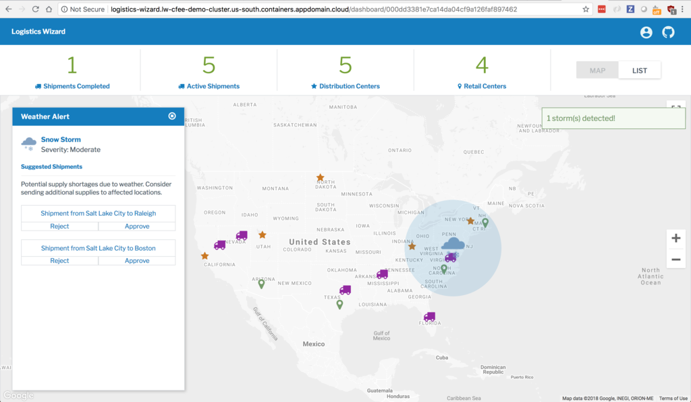

# Deploy Logistics Wizard to Cloud Foundry Enterprise Environment (CFEE)

These are instructions to deploy Logistic Wizard to Cloud Foundry Enterprise Environment. The applications is broken down into number of microservices, the core runtimes are deployed to CFEE and the services to public Cloud Foundry. 

**CFEE**

- Web UI runtime 
- ERP runtime 
- Controller runtime 

**Public Cloud Foundry**

- Cloudant used by the ERP
- Cloud Functions 
- Cloudant used by Cloud Functions 
- Weather Company Data used by Cloud Functions 

 The services must be created within the public CF and then linked to your Cloud Foundry Enterprise Environment (CFEE).

## Architecture

Logistics Wizard consists of several microservices.


The instructions below deploys to US South region, you can deploy to other regions available.

- (US South) CFEE API endpoint:   [https://api.lw-cfee-demo-cluster.us-south.containers.appdomain.cloud](https://api.lw-cfee-demo-cluster.us-south.containers.appdomain.cloud/)
- (US South) Public CF API endpoint: [https://api.ng.bluemix.net](https://api.ng.bluemix.net/) 

## Set up the ERP

1. In your terminal, login and point to Public CF API endpoint. 

   ```bash
   cf api https://api.ng.bluemix.net 
   cf login
   ```

2. Create the Cloudant database for the ERP:

   ```
   bx cf create-service cloudantNoSQLDB Lite logistics-wizard-erp-db
   ```

3. Then clone `logistics-wizard-erp` repo:

   ```bash
   git clone https://github.com/IBM-Cloud/logistics-wizard-erp
   cd logistics-wizard-erp
   ```

4. Edit the manifest.yml and remove the `logistics-wizard-erp-db` service listed.

   ToDo: check to this what else can be done here...

5. Switch to CFEE API endpoint.

   ```bash
   cf api https://api.lw-cfee-demo-cluster.us-south.containers.appdomain.cloud
   ```

   Get your CFEE API endpoint from the dashboard. 

6. push the ERP to CFEE

   ```bash
   cf push --no-start
   ```

7. Create service alias for the `logistics-wizard-erp-db` and then bind the database to the application. 

8. Create the ERP microservice in bluemix without starting it using the docker image you created above

9. Start the ERP microservice

   ```bash
   bx cf start <erp-name>
   ```

10. After starting the ERP microservice, you can verify it is running by hitting https://`<erp-name>`.containers.appdomain.cloud

    

## Set up the Controller Service

1. Clone the controller repo.

   ```bash
   git clone https://github.com/IBM-Cloud/logistics-wizard-controller
   cd logistics-wizard-controller
   ```

2. Push the controller microservice without starting.

   ```bash
   cf push --no-start
   ```

3. Set the environment variables for the controller to connect to the ERP and use Cloud Functions actions.

   ```
   cf set-env <controller-name> ERP_SERVICE 'https://lw-erp-cf-docker.mybluemix.net'
   cf set-env <controller-name> OPENWHISK_AUTH <openwhisk-auth>
   cf set-env <controller-name> OPENWHISK_PACKAGE lwr
   ```

   Example command: `cf set-env logistics-wizard-controller ERP_SERVICE https://logistics-wizard-erp.lw-cfee-demo-cluster.us-south.containers.appdomain.cloud`

4. Start the controller microservice.

   ```bash
   bx cf start <controller-name>
   ```

## Set up the Cloud Function Actions

Cloud Functions is outside CFEE, so you would need to switch to public CF. 

1. Switch to public CF 

   ```bash
   cf api https://api.ng.bluemix.net 
   ```

2. Create the two services needed `Cloudant` and  `Weather Company Data`.

   ```bash
   bx cf create-service weatherinsights Free-v2 logistics-wizard-weatherinsights
   bx cf create-service cloudantNoSQLDB Lite logistics-wizard-recommendation-db
   ```

3. Create service keys for both services and take note of the URL values. 

   ```bash
   cf create-service-key logistics-wizard-weatherinsights for-openwhisk
   cf create-service-key logistics-wizard-recommendation-db for-openwhisk
   cf service-key logistics-wizard-weatherinsights for-openwhisk
   cf service-key logistics-wizard-recommendation-db for-openwhisk
   ```

4. Clone the logistics-wizard-recommendation repo.

   ```bash
   git clone https://github.com/IBM-Cloud/logistics-wizard-recommendation
   cd logistics-wizard-recommendation
   ```

5. Copy the local env template file. 

   ```bash
   cp template-local.env local.env
   ```

6. Using the URL values from above update the local.env file to look like the following:

   ```bash
   PACKAGE_NAME=lwr
   CONTROLLER_SERVICE=<controller-service-url>
   WEATHER_SERVICE=<logistics-wizard-weatherinsights-url>
   CLOUDANT_URL=<logistics-wizard-recommendation-db-url>
   CLOUDANT_DATABASE=recommendations
   ```

7. Build your Cloud Functions actions.

   ```bash
   npm install
   npm run build
   ```

8. Deploy your Cloud Functions actions:

   ```bash
   ./deploy.sh --install
   ```
## Set up the WebUI

1. Switch to CFEE API endpoint.

   ```bash
   cf api  https://api.lw-cfee-demo-cluster.us-south.containers.appdomain.cloud
   ```

2. Clone the logistics-wizard-webui repo.

   ```bash
   git clone https://github.com/IBM-Cloud/logistics-wizard-webui
   cd logistics-wizard-webui
   ```

3. Install the dependencies.

   ```bash
   npm install
   ```

4. Build the static files for the UI using the appropriate environment variables.

   ```bash
   CONTROLLER_SERVICE=<controller-service-url> 
   npm run deploy:prod
   ```

   Example command: `CONTROLLER_SERVICE=https://logistics-wizard-controller.lw-cfee-demo-cluster.us-south.containers.appdomain.cloud/`

5. Deploy the app to CFEE.

   ```bash
   cd dist
   cf push <webui-name> -b staticfile_buildpack
   ```

   Done, now you should have Logistics Wizard deployed to CFEE. 

   